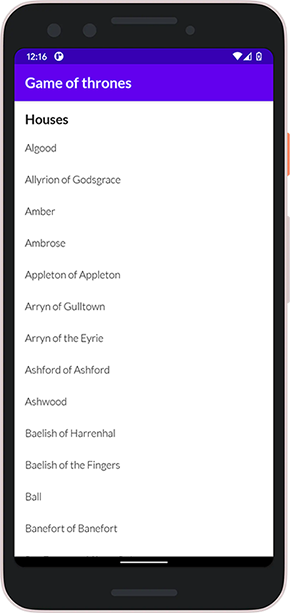
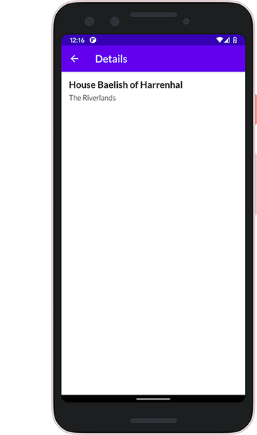

# Game of Thrones houses

Employment test. Android application that show's all GoT houses with details.

Data provided by <a href="https://anapioficeandfire.com/">An API of Ice And Fire</a>

Pure Kotlin app with MVVM concept including UseCase implementation.

- **Android Architecture Components**: LiveData, Core-testing
- **Compose**: Scaffold, LazyColumn, Custom typography font
- **Material Design**: Adaptive app icon
- Other: Koin dependency injection, Mockk, Coroutines, Retrofit, Http cache, Paging based data loading

## Requirements

- MinSdk 21 (Android 5.0)

## Download

Check out the app <a href="https://github.com/P72B/GoT/raw/main/assets/app-release-1.0.0-1-a946ae.apk" download>Download</a>

